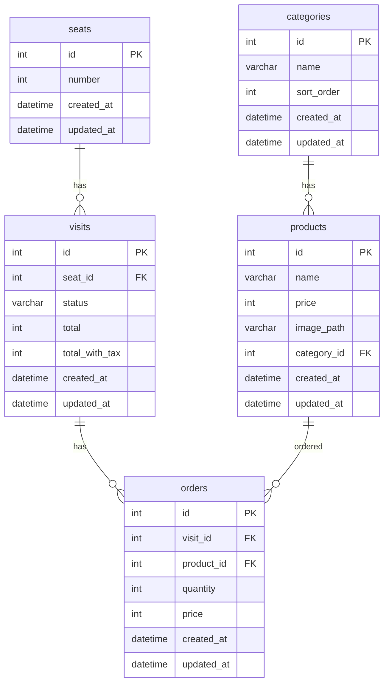

```mermaid
erDiagram

    categories ||--o{ products : "has"
    seats ||--o{ visits : "has"
    visits ||--o{ orders : "has"
    products ||--o{ orders : "ordered"

    categories {
        int id PK
        varchar name
        int sort_order
        datetime created_at
        datetime updated_at
    }

    products {
        int id PK
        varchar name
        int price
        varchar image_path
        int category_id FK
        datetime created_at
        datetime updated_at
    }

    seats {
        int id PK
        int number
        datetime created_at
        datetime updated_at
    }

    visits {
        int id PK
        int seat_id FK
        varchar status
        int total
        int total_with_tax
        datetime created_at
        datetime updated_at
    }

    orders {
        int id PK
        int visit_id FK
        int product_id FK
        int quantity
        int price
        datetime created_at
        datetime updated_at
    }
```